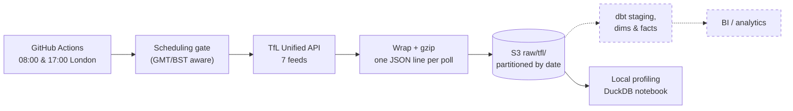

# tfl_ttl

A data pipeline that collects Transport for London (TfL) network data on a
schedule and lands it, untouched, in Amazon S3, ready to be modelled into a
star schema for analysis.

It snapshots the London Underground, DLR, Overground and Elizabeth line twice a
day: every line's status (good service, delays, closures) and every station
disruption (such as lifts out of service). Weekly, it also collects the
reference data needed to describe them: lines, stations, modes and severity
levels.

> **Status: benched (October 2026).** Ingestion is complete, tested and running
> on a schedule until 26 November 2026. The modelling layer (dbt) hasn't been
> built. See [Status and what's next](#status-and-whats-next).

## How it works



1. **Schedule.** A GitHub Actions workflow fires at 08:00 and 17:00 London
   time. GitHub only schedules in UTC, so each slot has two triggers, and a
   small gate lets exactly one of each pair run, in winter and summer alike.
2. **Fetch.** The pipeline calls the TfL API for each feed: four transport
   modes per feed where it applies.
3. **Land raw.** Each response is stored exactly as TfL sent it, wrapped with
   metadata about the poll and gzipped, one file per call. Nothing is cleaned
   or reshaped at this stage. TfL has no history endpoint, so this raw copy is
   the only record of what the network looked like at that moment.
4. **Check.** Only after landing does the pipeline validate the response (is
   it a list, is it unexpectedly empty, is it missing pages). A surprising
   response costs a failed run, never a lost poll.
5. **Model (planned, not built).** dbt would unnest the JSON into staging
   models, then dimensions, a line-to-station bridge and two periodic snapshot
   facts. The design is complete; the DuckDB views in the profiling notebook
   are rough drafts of the staging models.

## Stack

| Layer | Built | Planned |
|---|---|---|
| Language & tooling | Python 3.10+, uv, ruff, pre-commit | |
| Ingestion | `requests` with retries, boto3 | |
| Storage | Amazon S3 (gzipped JSON, Hive-style date partitions) | |
| Scheduling | GitHub Actions cron, AWS login via OIDC | Airflow for the dbt runs |
| Testing & CI | pytest (100% coverage), GitHub Actions on Python 3.10 and 3.13 | dbt tests |
| Exploration | Jupyter, DuckDB (and its local UI) | |
| Modelling | | dbt, on Athena or Snowflake |

## Feeds and schedule

| Feed | TfL endpoint | Polled | Becomes |
|---|---|---|---|
| `line_status` | `/Line/Mode/{mode}/Status` | 08:00 & 17:00 | Fact: each line's status per poll |
| `stop_point_disruptions` | `/StopPoint/Mode/{mode}/Disruption` | 08:00 & 17:00 | Fact: each station disruption per poll |
| `lines` | `/Line/Mode/{mode}` | Monday 08:00 | Dimension: lines |
| `stop_points` | `/StopPoint/Mode/{mode}` | Monday 08:00 | Dimension: stations, plus the line-to-station bridge |
| `modes` | `/Line/Meta/Modes` | Monday 08:00 | Dimension: transport modes |
| `severity` | `/Line/Meta/Severity` | Monday 08:00 | Dimension: what each severity level means, per mode |
| `disruption_categories` | `/Line/Meta/DisruptionCategories` | Monday 08:00 | Reference list |

Feeds with `{mode}` are polled once per mode: `dlr`, `elizabeth-line`,
`overground` and `tube`. The registry lives in
[`src/tfl_ttl/feeds.py`](src/tfl_ttl/feeds.py); adding a feed is one entry.

## Data in S3

```
raw/tfl/<feed>/poll_date=YYYY-MM-DD/YYYYMMDDTHHMMSSZ[_<mode>].json.gz
```

Each file is one line of JSON:

```json
{
  "polled_at": "2026-10-06T07:00:04+00:00",
  "feed": "line_status",
  "mode": "tube",
  "source_url": "https://api.tfl.gov.uk/Line/Mode/tube/Status",
  "record_count": 11,
  "response": ["... exactly what TfL returned ..."]
}
```

- `polled_at` is when the request really happened, even if the scheduled run
  started late.
- `poll_date=` folders let query engines (Athena, DuckDB) skip dates a query
  doesn't need.
- `record_count` lets a query spot suspiciously small polls without opening
  the response.

## Repo layout

```
src/tfl_ttl/
  __main__.py        Entry point: python -m tfl_ttl (options below)
  config.py          Settings from the environment / .env
  feeds.py           The feed registry and validation rules
  tfl_api.py         HTTP session with retries; fetches one URL
  record.py          Builds the wrapped record, gzips it, builds the S3 key
  s3.py              Upload, and download for local profiling
  schedule.py        The scheduling gate (London time, end date, weekly runs)
tests/               One test file per module; shared fixtures in conftest.py
notebooks/
  01_tfl_api_eda.ipynb      First exploration of the API
  02_raw_profiling.ipynb    Per-feed profiling in DuckDB; drafts of staging models
.github/workflows/
  ci.yml             Lint, format and tests on every PR and push to master
  ingest.yml         The scheduled ingestion
data/                Local downloads and DuckDB database (gitignored)
```

## Security model

- **No stored AWS keys in GitHub.** The workflow logs in with OIDC: GitHub
  issues a signed token for each run, and AWS exchanges it for credentials
  that expire within an hour. Only this repo's `master` branch can use the
  role `tfl-raw-writer-github`.
- **Least privilege throughout.** Each AWS identity can do one thing:

  | Identity | Used by | Can |
  |---|---|---|
  | `tfl-raw-writer-github` (role) | Scheduled workflow | Upload to `raw/tfl/` and `raw/tfl_verify/` |
  | `raw-writer` (user, local profile) | Local polls | Upload |
  | `tfl-reader` (user, local profile) | Profiling notebook | List and read `raw/tfl*` |

  None of them can delete anything.
- **Public logs stay clean.** The bucket name, role ARN and TfL key are GitHub
  secrets (masked as `***`), the account ID is masked explicitly, and request
  errors are re-raised without the URL's query string so the API key never
  reaches a log.
- **Notebooks are committed without outputs** (`nbstripout` pre-commit hook).

## Running it

**Setup**

```bash
uv sync                        # Python dependencies, including dev tools
uv run pre-commit install      # lint and strip notebook outputs on commit
```

AWS credentials live as named profiles in `~/.aws/credentials`, never in the
repo. Copy [`.env.example`](.env.example) to `.env`, then set `AWS_PROFILE`
(the profile used for uploads), `S3_BUCKET` and optionally `TFL_APP_KEY`.

**Poll locally**

```bash
uv run python -m tfl_ttl --feed modes         # one feed
uv run python -m tfl_ttl --frequency weekly   # every weekly feed
```

Those land in `raw/tfl/`, the real history. For a test poll, send it to
`raw/tfl_verify/` instead (a lifecycle rule empties that folder after 7 days)
by setting `S3_PREFIX` for one command only. A variable already set in the
shell wins over `.env`, so `.env` stays untouched:

```powershell
# PowerShell
$env:S3_PREFIX = "raw/tfl_verify"; uv run python -m tfl_ttl --feed modes; Remove-Item Env:S3_PREFIX
```

```bash
# bash
S3_PREFIX=raw/tfl_verify uv run python -m tfl_ttl --feed modes
```

**Profile the data**

```bash
uv run jupyter lab
```

Open `notebooks/02_raw_profiling.ipynb` and run the first cell. It downloads
with the read-only profile, keeps views in a local DuckDB database, and opens
the DuckDB UI.

**Tests and linting**

```bash
uv run pytest                  # all tests, with coverage (must stay at 100%)
uv run ruff check .            # lint
uv run ruff format .           # format
```

No test touches TfL or AWS: the network and boto3 are faked, and dummy AWS
credentials are swapped in for every test.

## Scheduled ingestion

[`.github/workflows/ingest.yml`](.github/workflows/ingest.yml) needs these
settings (Settings → Secrets and variables → Actions):

- **Secrets:** `AWS_ROLE_ARN`, `S3_BUCKET`, `TFL_APP_KEY`.
- **Variable:** `INGEST_END_DATE`, the last London date to poll on (inclusive).
  After it, scheduled runs skip themselves. Edit it to extend collection. If
  it's missing or malformed, scheduled runs fail rather than collect forever.

To test one feed by hand: **Actions → Ingest → Run workflow**, pick a feed,
and it lands in `raw/tfl_verify/` by default. Failed runs email the repo owner.

## Status and what's next

**Done:** API exploration and dimensional design; ingestion with validation,
tests and CI; profiling of every feed; scheduled collection with OIDC.

**Benched** in October 2026. The project was built around one organisation's
AWS stack (Athena, Glue, dbt-athena), which turned out to be a narrower skill
than hoped. Collection keeps running until 26 November 2026.

**If picked up again**, the raw layer doesn't depend on any query engine, so
either route works:

- **Snowflake:** an external stage over `raw/tfl/`, then dbt-snowflake models.
- **Athena:** an external table over `raw/tfl/` in DDL, then dbt-athena models.

Either way, the modelling work is the same: staging models from the notebook's
views, then the dimensions, bridge and facts from the design, with dbt tests,
plus a check that every expected poll exists.
